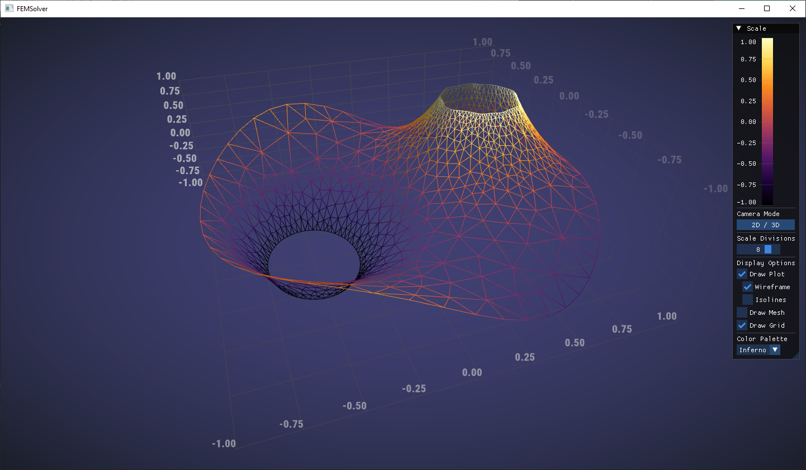
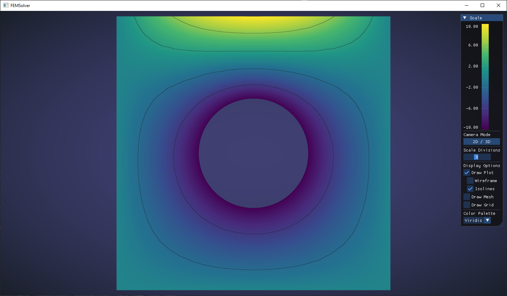
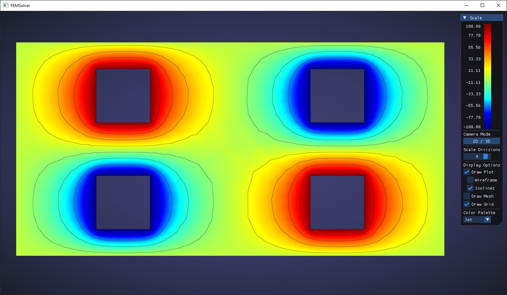
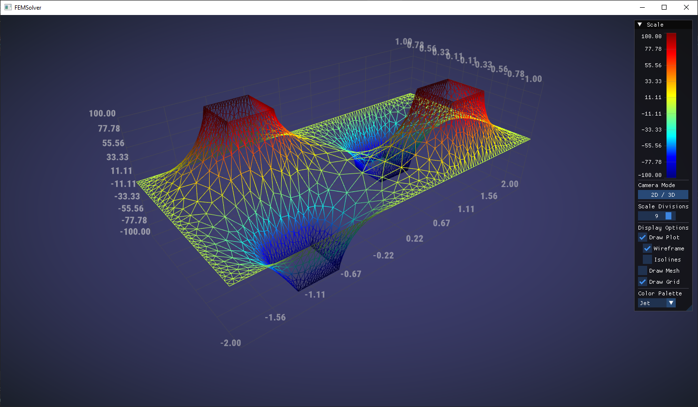
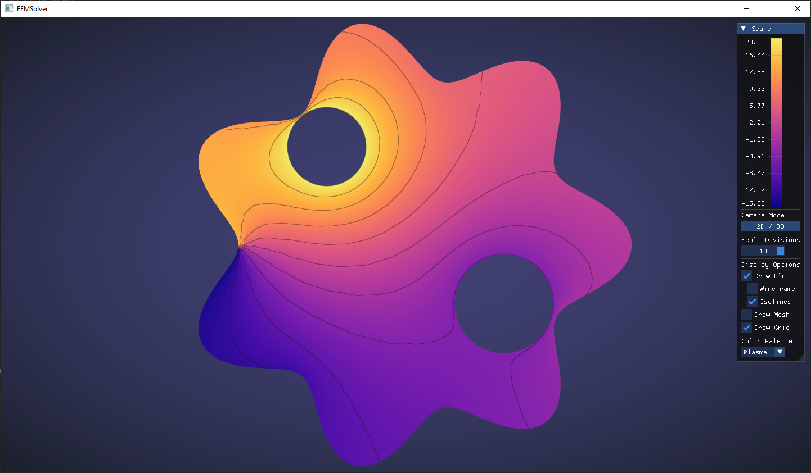
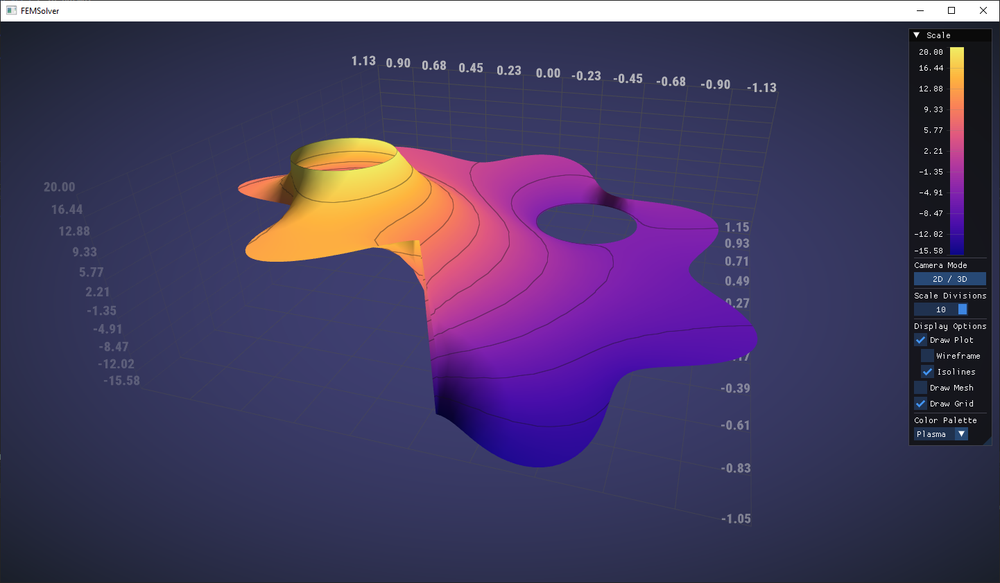
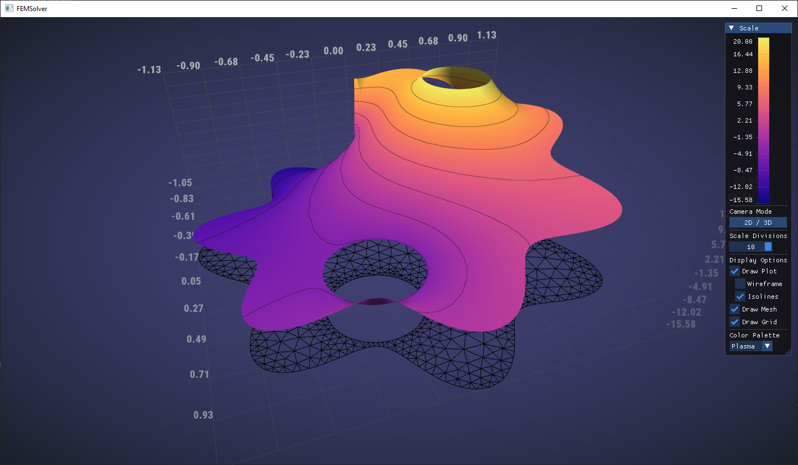

# FEMSolver: A C++ Finite Element Method Solver for 2D Diffusion Problems


## 📖 Project Description

**FEMSolver** is a comprehensive C++ application that demonstrates a complete pipeline for solving 2D steady-state diffusion boundary value problems using the Finite Element Method (FEM). The project is built from the ground up, featuring custom data structures and algorithms for each stage of the process.

Its purpose is to serve as an educational and practical tool for understanding advanced numerical methods and real-time graphics rendering. The application handles everything from complex mesh generation to the iterative solving of the resulting linear system and provides a feature-rich graphical interface for visualizing the results.

### Key Features 💡

* **Advanced Mesh Generation**:
    * **Poisson Disc Sampling**: Implements a variable radius Poisson disc sampling using **Bridson's algorithm** to generate a well-distributed set of nodes within a complex 2D domain. This ensures high-quality elements by preventing nodes from being too close to each other.
    * **Delaunay Triangulation**: Employs the **Bowyer-Watson algorithm** to create an optimal triangular mesh from the generated nodes.
    * **Half-Edge Data Structure**: Uses a custom, index-based half-edge data structure for efficient and robust topological mesh queries and manipulations.

* **Finite Element Method (FEM) Core**:
    * **Simplicial Linear Elements**: Uses linear triangular elements (3 nodes) to discretize the problem domain.
    * **Analytical Integration**: Uniquely, the solver computes element matrices through **analytical integration**. This is achieved with a powerful, custom-built `Polynomial` class that supports multi-variable calculus (derivatives, integrals) on polynomial expressions.
    * **Conjugate Gradient Solver**: Solves the assembled sparse linear system **(Ax=b)** using an efficient iterative **Conjugate Gradient method**.

* **Interactive Visualization and GUI**:
    * **OpenGL Rendering**: Provides real-time 2D and 3D visualization of the mesh and solution field using modern OpenGL (version 4.5).
    * **Interactive Camera**: Includes a versatile camera with seamless switching between 2D (pan/zoom) and 3D (orbit/zoom) modes.
    * **Data Visualization**: Renders the solution field as a colored surface, with support for dynamic isolines, wireframe overlays, and multiple color palettes (Viridis, Inferno, Jet, etc.).
    * **Dear ImGui Interface**: A clean and intuitive GUI allows for real-time manipulation of rendering parameters, including camera mode, color maps, scale divisions, and display options.

---

## 📸 Application Screenshots

**2D Mesh View:**


**2D Soluttion View:**


**3D Solution Plot with Isolines:**


**3D Solution Wireframe:**


---

## 🛠️ Installation and Building Instructions

This project uses **CMake** to manage the build process. Below are detailed instructions to get the project compiled and running on your system.

---

### 1. Prerequisites

Before you begin, ensure you have the following software installed:

* **CMake**: Version 3.20 or higher.
* **A C++17 compliant compiler**: Such as GCC, Clang, or MSVC (included with Visual Studio).
* **Git**: For cloning the repository.

---

### 2. Dependencies

The project relies on several external libraries:

* **GLEW** (The OpenGL Extension Wrangler Library)
* **GLFW3** (A multi-platform library for OpenGL)
* **GLM** (OpenGL Mathematics)
* **Freetype** (A software font engine)
* **Dear ImGui** (Bloat-free Graphical User interface)

---

### 3. Dependency Installation

You have multiple options for installing these dependencies. **Method A is highly recommended for a smooth experience.**

#### Method A: Using vcpkg (Recommended) 📦

**vcpkg** is a C/C++ library manager that simplifies acquiring and linking dependencies across all platforms (Windows, macOS, Linux).

1.  **Install vcpkg**: If you don't have vcpkg, follow the [official vcpkg quick start guide](https://vcpkg.io/en/getting-started.html) to install it.

2.  **Install the required libraries**: Open your terminal or PowerShell and run the following command. This will download and build all necessary packages.

    ```bash
    vcpkg install glew glfw3 glm freetype imgui[glfw-binding,opengl3-binding]
    ```
    > **Note**: The `[glfw-binding,opengl3-binding]` features for ImGui are essential as they provide the necessary backend code to integrate ImGui with GLFW and OpenGL.

3.  **(Optional but Recommended for Visual Studio users)** **Integrate vcpkg with your build environment**: This step makes Visual Studio automatically aware of all libraries installed by vcpkg.
    ```bash
    vcpkg integrate install
    ```

#### Method B: Using System Package Managers (Untested) 🧪

This method is provided as a guideline for experienced Linux and macOS users. **It has not been tested and may require additional troubleshooting.**

* **Ubuntu/Debian (apt)**:
    ```bash
    sudo apt update
    sudo apt install libglew-dev libglfw3-dev libglm-dev libfreetype6-dev
    ```

* **macOS (Homebrew)**:
    ```bash
    brew install glew glfw glm freetype
    ```

> **Important**: System package managers typically do not provide Dear ImGui with the necessary bindings. If you use this method, you will likely need to integrate ImGui into the project manually (e.g., by adding it as a Git submodule).

#### Method C: Manual Installation (Not Recommended) ⚠️

If you choose not to use a package manager, you will need to download, build, and install each dependency yourself. You must then ensure CMake can find them, likely by setting the `CMAKE_PREFIX_PATH` environment variable. This process is complex and platform-dependent.

---

### 4. Building the Project ⚙️

The build steps depend on how you installed the dependencies.

#### Building with vcpkg (Command Line)

1.  **Clone the repository**:
    ```bash
    git clone [https://github.com/maksf113/FEMSolver.git](https://github.com/maksf113/FEMSolver.git)
    cd FEMSolver
    ```

2.  **Configure with CMake**: You **must** point CMake to the vcpkg toolchain file.
    ```bash
    # Replace [path/to/vcpkg] with the actual path to your vcpkg installation
    cmake -B build -S . -DCMAKE_TOOLCHAIN_FILE=[path/to/vcpkg]/scripts/buildsystems/vcpkg.cmake
    ```

3.  **Build the executable**:
    ```bash
    cmake --build build
    ```

#### Building with Visual Studio + vcpkg integration (Easiest Method)

If you ran `vcpkg integrate install`, this process is incredibly simple.

1.  Open **Visual Studio** and select **File -> Open -> CMake...**.
2.  Navigate to the cloned `FEMSolver` directory and select the `CMakeLists.txt` file.
3.  Visual Studio will automatically configure the project. You can then build and run from the IDE.

#### Building with System/Manual Dependencies

1.  **Clone the repository** and `cd` into it.
2.  **Configure and Build**:
    ```bash
    cmake -B build
    cmake --build build
    ```

---

### 5. Running the Application ▶️

After a successful build, the executable will be located in the `build` directory (or a subdirectory like `build/Debug` on Windows).

```bash
# On Linux/macOS
./build/FEMSolver

# On Windows
./build/Debug/FEMSolver.exe

---

## 🚀 Usage

Upon running the executable, the application will automatically generate a mesh for a predefined domain, solve the diffusion problem, and display the results.

### Customizing the Simulation

You can easily modify the simulation parameters to solve your own problems:

1.  **Defining the Domain Geometry**:
    * Open `FEMSolver/src/geometry/Boundaries.hpp`.
    * Modify the `Boundaries::Boundaries()` constructor to define the points for your outer and inner boundaries. The domain is defined by a single closed outer boundary and any number of closed inner boundaries (holes).
    * The points for each boundary should be defined as a sequence of `Point` objects in an `Array<Point>`. The order of points should define the polygon shape.
    * The example code generates a circular outer boundary and two complex inner boundaries using parametric equations. You can replace this with your own logic to define custom shapes.

        ```cpp
        // Example from Boundaries.hpp:
        Boundaries::Boundaries()
        {
            // Define the number of points for each boundary
            size_t n_outer = 50;
            size_t n_inner1 = 70;
            m_outer.resize(n_outer);
            m_inner.pushBack(Array<Point>(n_inner1)); // Add the first inner boundary

            // Define the shape of the outer boundary (e.g., a circle)
            double R = 1.0;
            for (int i = 0; i < m_outer.size(); i++)
            {
                m_outer[i][0] = R * cos(2.0 * pi() / n_outer * i);
                m_outer[i][1] = R * sin(2.0 * pi() / n_outer * i);
            }

            // Define the shape of the inner boundary (e.g., an ellipse)
            double r = 0.3;
            for (int i = 0; i < m_inner[0].size(); i++)
            {
                m_inner[0][i][0] = 0.8 * r * cos(2.0 * pi() / n_inner1 * i) - 0.5;
                m_inner[0][i][1] = r * sin(2.0 * pi() / n_inner1 * i);
            }
            // ... and so on for other boundaries
        }
        ```

2.  **Setting Boundary Conditions and Source Term**:
    * Open `FEMSolver/src/solver/Solver.hpp`.
    * In the `Solver::Solver()` constructor, you can define your boundary conditions and the source term of the PDE.
    * **Boundary Conditions**: Use `m_bcManager.addBC()` to add Dirichlet boundary conditions. The function takes a lambda that defines the value of the solution at a given `Point`. The boundary ID corresponds to the order in which boundaries were defined (0 for outer, 1 for the first inner, etc.).
        ```cpp
        // Example: Set boundary 0 to have a value of sin(3*x)
        m_bcManager.addBC({ [](const Point& p) { return std::sin(3.0 * p[0]); } }); // Boundary ID 0
        ```
    * **Source Term**: The `source` lambda function defines the right-hand side `f(x, y)` of the Poisson equation `∇²u = f`. Modify this lambda to set your desired source term.
        ```cpp
        // Example: Set a constant source term of 10.0
        std::function<double(const Point& p)> source = [](const Point& p) { return 10.0; };
        ```

---

## 📂 Project Structure
```
FEMSolver/
├── src/
│   ├── data_structures/ # Custom data structures (Array, List, Map, etc.)
│   ├── geometry/ # Mesh generation (Boundaries, Triangulation, BridsonGrid)
│   ├── graphics/ # OpenGL rendering, shaders, and visualization tools
│   ├── math/ # Custom math library (Vector, Matrix, Polynomial)
│   ├── solver/ # Core FEM logic (Solver, Mesh, FiniteElement, Sparse Matrix)
│   ├── tools/ # Utility classes (e.g., Random)
│   ├── window/ # Window and input management (GLFW, ImGui)
│   ├── Application.hpp # Main application class orchestrating all components
│   └── main.cpp # Entry point of the application
├── fonts/ # Font files (e.g., Roboto_Condensed-Black.ttf)
├── screenshots/ # Application screenshots
└── CMakeLists.txt # CMake build script
```

---

## 📝 To-Do List & Future Improvements

This project serves as a strong foundation, and there are several exciting directions for future development:

* **Implement Higher-Order Elements**: Extend the solver to support quadratic or cubic basis functions for increased accuracy.
* **Add Preconditioning**: Implement a preconditioner (e.g., Jacobi or Incomplete Cholesky) to accelerate the convergence of the Conjugate Gradient solver.
* **Explore Other Iterative Solvers**: Integrate other iterative methods like GMRES or BiCGSTAB to compare performance for different problem types.
* **Enhance Mesh Quality**: Improve the mesh generation process to refine the mesh near boundaries or areas of high gradient for more accurate solutions.

---

## 📜 License

This project is licensed under the MIT License. See the `LICENSE` file for details.

---

## 📞 Contact Information

For any questions, feedback, or suggestions, please feel free to reach out.

* **Email**: maksymilian.frankiewicz@gmail.com

---

## 📸 More Screenshots














